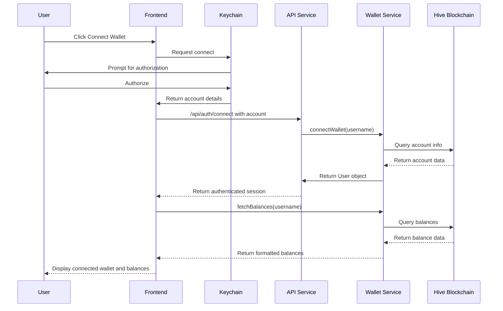
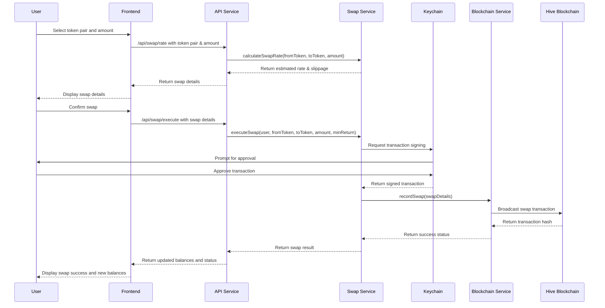
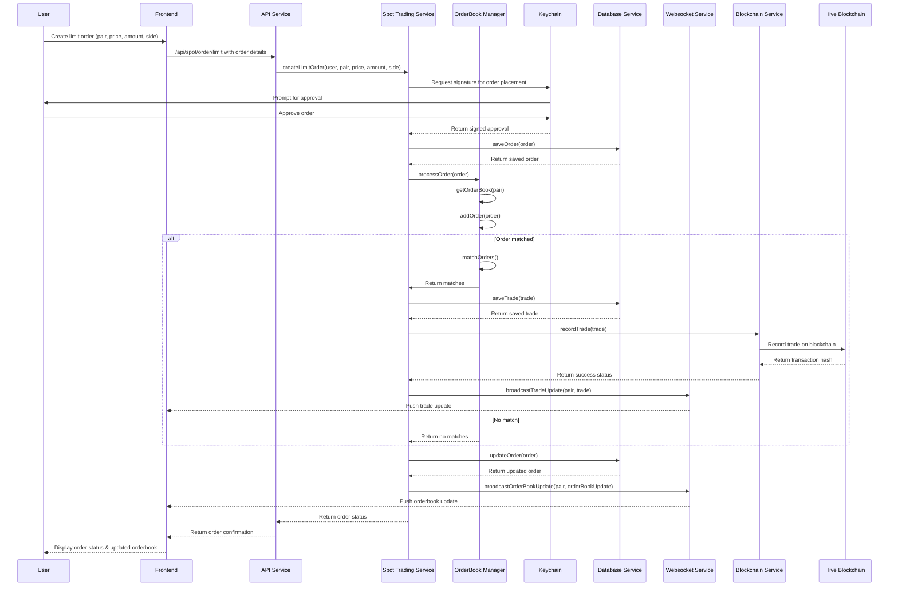
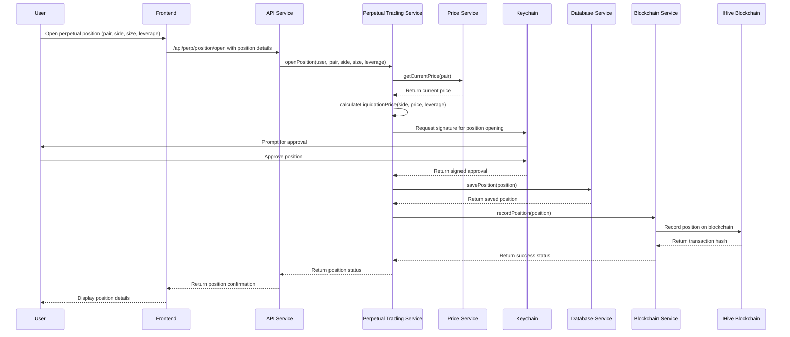

# RedHi System Design Document

## Implementation approach

For implementing RedHi, a decentralized orderbook-based exchange on the Hive blockchain, we'll take the following approach:

### Challenges and Solutions

1. **Decentralized but Fast Trading**:
   - Challenge: Keeping the exchange decentralized while ensuring fast trading operations.
   - Solution: Use MongoDB for off-chain orderbook maintenance while recording finalized transactions on Hive blockchain. This hybrid approach provides speed while maintaining transparency.

2. **Perpetual Contracts with Leverage**:
   - Challenge: Implementing perpetual contracts with up to x50 leverage without complex liquidation logic.
   - Solution: For the MVP, implement a simplified perpetual contract system using MongoDB to track positions and calculate leverage. Use Hive blockchain only for recording open/close positions.

3. **Security for Trading Operations**:
   - Challenge: Ensuring secure trading operations without holding user keys.
   - Solution: Integrate with Hive Keychain for transaction signing, keeping the system non-custodial.

### Technology Selection

- **Frontend**: React.js with Tailwind CSS for a clean, responsive interface inspired by V4V.
- **Charts**: Lightweight Charts for efficient real-time price visualization.
- **Backend**: Bun as JavaScript runtime with Express.js for API endpoints.
- **Database**: MongoDB Atlas for storing the orderbook, user positions, and trading data.
- **Blockchain Integration**: Hive-JS for interacting with the Hive blockchain.
- **Authentication**: Hive Keychain for secure wallet connection and transaction signing.
- **Deployment**: Vercel for frontend, Render for backend, MongoDB Atlas for database.

This architecture balances the need for decentralization with the practical requirements of a functional exchange, using established libraries and services to accelerate development while maintaining security and transparency.

## Data structures and interfaces

The system consists of several core components that handle different aspects of the decentralized exchange:

1. **Authentication & Wallet Management**
2. **Token Swap Module**
3. **Spot Trading Engine**
4. **Perpetual Trading Engine**
5. **Orderbook Management**
6. **Blockchain Integration Layer**

Below is a detailed class diagram showing the system's key components and their relationships.

```mermaid
classDiagram
    class User {
        +String username
        +String accountName
        +Object balances
        +Array positions
        +Array orders
        +getBalance(token: String) Number
        +updateBalance(token: String, amount: Number) void
    }
    
    class WalletService {
        +connectWallet(username: String) Promise~User~
        +fetchBalances(username: String) Promise~Object~
        +signTransaction(tx: Object) Promise~Object~
        +broadcastTransaction(signedTx: Object) Promise~Object~
    }
    
    class KeychainIntegration {
        +requestSignBuffer(username: String, message: String, key: String) Promise~Object~
        +requestBroadcast(username: String, operations: Array) Promise~Object~
        +requestTransfer(username: String, recipient: String, amount: Number, memo: String, currency: String) Promise~Object~
    }
    
    class Token {
        +String symbol
        +String name
        +Number decimals
        +String blockchain
        +Number totalSupply
    }
    
    class SwapService {
        +calculateSwapRate(fromToken: Token, toToken: Token, amount: Number) Promise~Object~
        +executeSwap(user: User, fromToken: Token, toToken: Token, amount: Number, minReturn: Number) Promise~Object~
        +getSwapPairs() Promise~Array~
    }
    
    class Order {
        +String id
        +String userId
        +String pair
        +String type
        +Number price
        +Number amount
        +Number filled
        +String status
        +Date timestamp
        +Boolean isCancelled
        +cancel() Promise~Boolean~
        +fill(amount: Number) Promise~Boolean~
    }
    
    class SpotTradingService {
        +createLimitOrder(user: User, pair: String, price: Number, amount: Number, side: String) Promise~Order~
        +createMarketOrder(user: User, pair: String, amount: Number, side: String) Promise~Order~
        +cancelOrder(orderId: String) Promise~Boolean~
        +getOrderHistory(userId: String) Promise~Array~
        +getOpenOrders(userId: String) Promise~Array~
    }
    
    class OrderBook {
        +String pair
        +Array bids
        +Array asks
        +addOrder(order: Order) void
        +removeOrder(orderId: String) void
        +matchOrders() Promise~Array~
        +getBidAsk() Object
        +getDepth(levels: Number) Object
    }
    
    class OrderBookManager {
        -Map orderBooks
        +getOrderBook(pair: String) OrderBook
        +createOrderBook(pair: String) OrderBook
        +processOrder(order: Order) Promise~Array~
        +getMarketDepth(pair: String, levels: Number) Object
    }
    
    class Trade {
        +String id
        +String pair
        +String makerOrderId
        +String takerOrderId
        +Number price
        +Number amount
        +Date timestamp
    }
    
    class PerpetualPosition {
        +String id
        +String userId
        +String pair
        +String side
        +Number entryPrice
        +Number size
        +Number leverage
        +Number liquidationPrice
        +Date openTime
        +Date closeTime
        +Boolean isOpen
        +Number pnl
        +calculatePnL(currentPrice: Number) Number
        +close(exitPrice: Number) Promise~Object~
    }
    
    class PerpetualTradingService {
        +openPosition(user: User, pair: String, side: String, size: Number, leverage: Number, price: Number) Promise~PerpetualPosition~
        +closePosition(positionId: String, price: Number) Promise~Object~
        +getOpenPositions(userId: String) Promise~Array~
        +getPositionHistory(userId: String) Promise~Array~
        +calculateLiquidationPrice(side: String, entryPrice: Number, leverage: Number) Number
    }
    
    class PriceService {
        +getCurrentPrice(pair: String) Promise~Number~
        +getPriceHistory(pair: String, timeframe: String) Promise~Array~
        +subscribeToPriceUpdates(pair: String, callback: Function) void
    }
    
    class BlockchainService {
        +recordTrade(trade: Trade) Promise~Object~
        +recordPosition(position: PerpetualPosition) Promise~Object~
        +recordSwap(swap: Object) Promise~Object~
        +queryTransactions(accountName: String, type: String) Promise~Array~
    }
    
    class DatabaseService {
        +saveOrder(order: Order) Promise~Order~
        +getOrder(orderId: String) Promise~Order~
        +updateOrder(order: Order) Promise~Order~
        +saveTrade(trade: Trade) Promise~Trade~
        +savePosition(position: PerpetualPosition) Promise~PerpetualPosition~
        +getPosition(positionId: String) Promise~PerpetualPosition~
        +updatePosition(position: PerpetualPosition) Promise~PerpetualPosition~
    }
    
    class APIService {
        +initializeRoutes() void
        +handleRequest(req: Object, res: Object) Promise~void~
        +authenticateRequest(req: Object) Promise~Boolean~
    }
    
    class WebsocketService {
        +initializeServer() void
        +broadcastOrderBookUpdate(pair: String, data: Object) void
        +broadcastTradeUpdate(pair: String, trade: Trade) void
        +broadcastPriceUpdate(pair: String, price: Number) void
    }
    
    User "1" -- "*" Order : places
    User "1" -- "*" PerpetualPosition : holds
    WalletService -- KeychainIntegration : uses
    SwapService -- Token : processes
    SpotTradingService -- Order : creates
    SpotTradingService -- OrderBookManager : uses
    OrderBookManager "1" -- "*" OrderBook : manages
    OrderBook -- Order : contains
    OrderBook -- Trade : generates
    PerpetualTradingService -- PerpetualPosition : manages
    SpotTradingService -- PriceService : uses prices from
    PerpetualTradingService -- PriceService : uses prices from
    PerpetualTradingService -- BlockchainService : records positions with
    SpotTradingService -- BlockchainService : records trades with
    SwapService -- BlockchainService : records swaps with
    APIService -- WalletService : authenticates via
    APIService -- SpotTradingService : routes to
    APIService -- SwapService : routes to
    APIService -- PerpetualTradingService : routes to
    WebsocketService -- OrderBookManager : broadcasts
    WebsocketService -- PriceService : broadcasts
    SpotTradingService -- DatabaseService : persists data
    PerpetualTradingService -- DatabaseService : persists data
```

## Program call flow

The sequence diagrams below illustrate the key flows within the RedHi platform:

1. Wallet Connection Flow
2. Token Swap Flow
3. Spot Trading Flow
4. Perpetual Trading Flow

### Wallet Connection Flow

### Token Swap Flow

### Spot Trading Flow - Limit Order

### Perpetual Trading Flow - Open Position

## Anything UNCLEAR

1. **Liquidation mechanism**: The PRD mentions that complex liquidation mechanisms are out of scope for the MVP. We should clarify how liquidation will be handled in the simple implementation. Will positions be monitored for liquidation price breaches? Will there be an automated liquidation process?

2. **Price feeds**: The system requires real-time price data for spot and perpetual trading. The PRD doesn't specify if we should use internal price discovery from the orderbook or integrate with external price oracles.

3. **Token standard**: For trading non-native Hive tokens (BTC, ETH, USDT), we need to clarify which token standard will be used. Are these wrapped tokens on Hive-Engine, or will we interact with external blockchains?

4. **Fees structure**: How will trading fees be implemented? Will there be maker/taker fees? How will these be collected and distributed?

5. **Funding rate for perpetuals**: For perpetual contracts, a funding rate mechanism is typically required to keep the perpetual price close to the index price. The PRD doesn't specify how this will be implemented.
